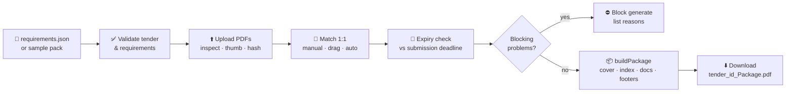
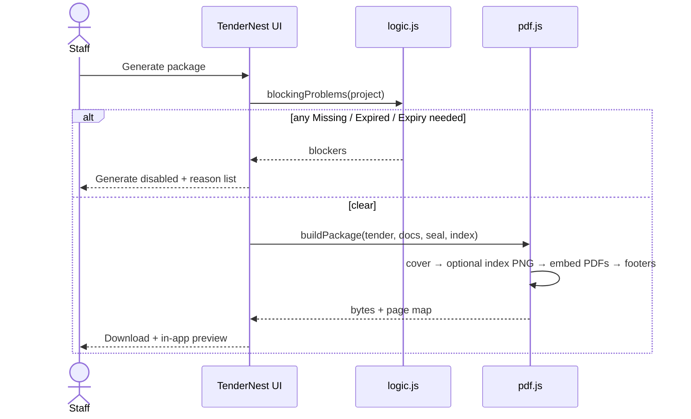
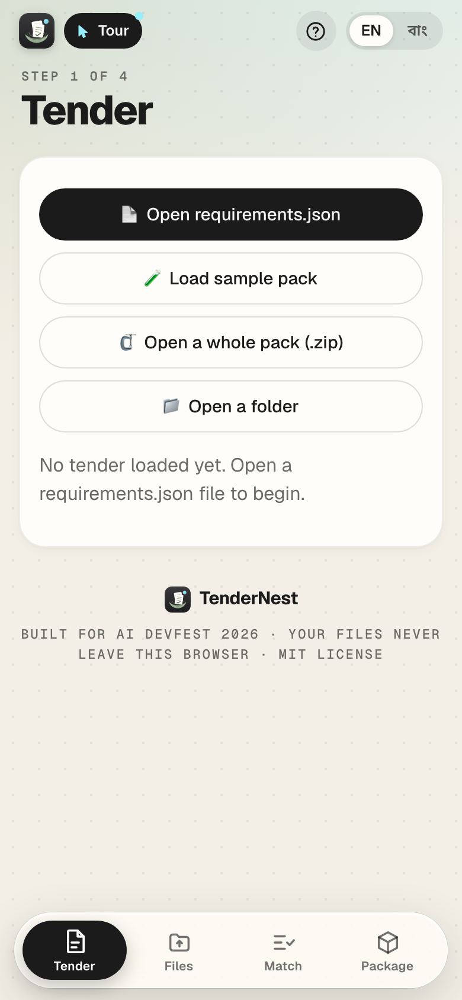
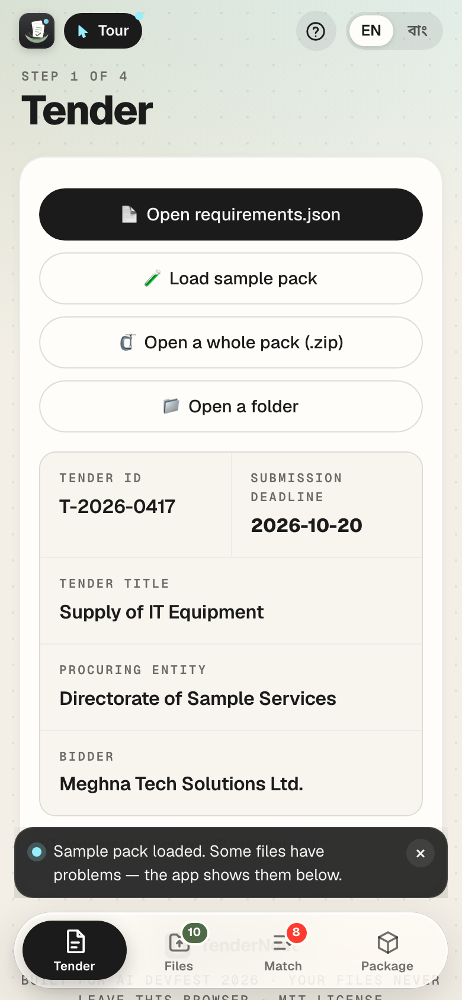
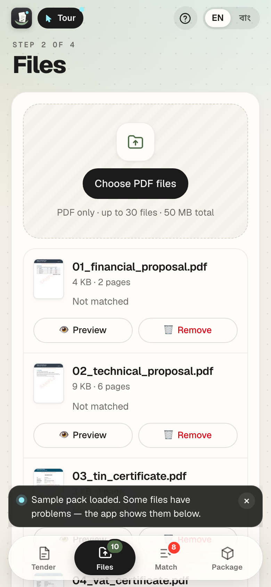
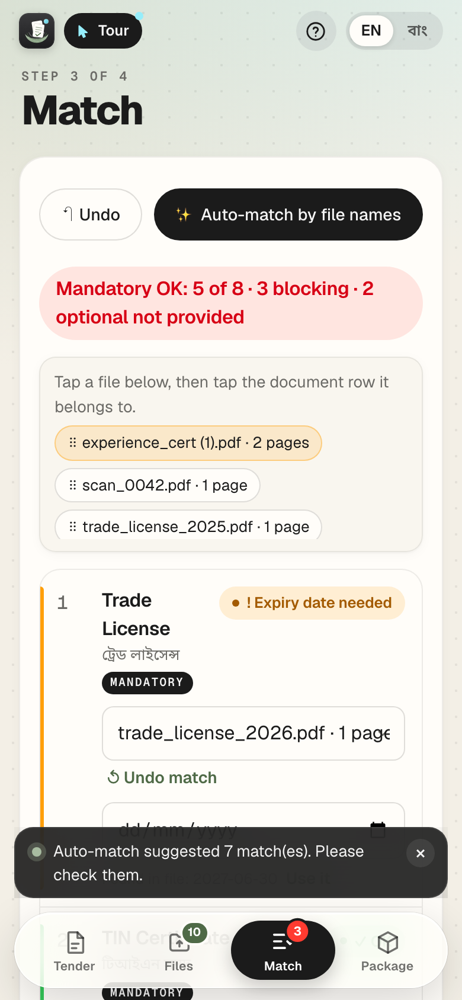
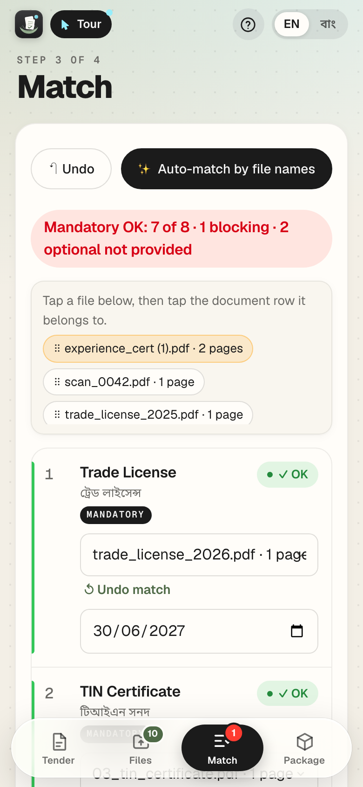
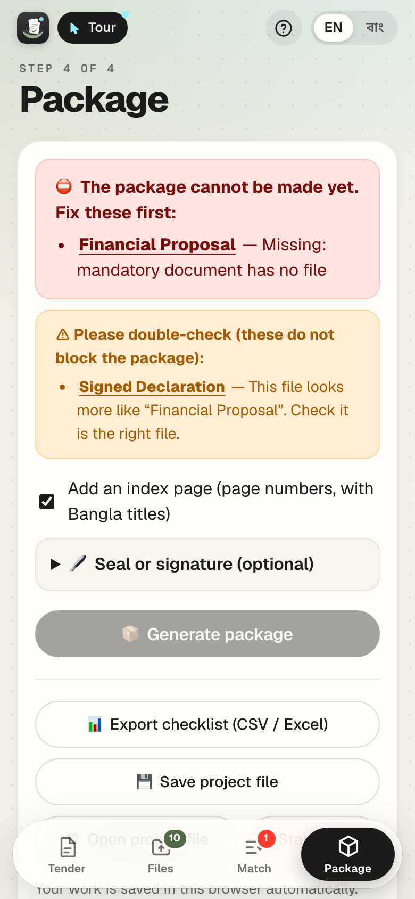
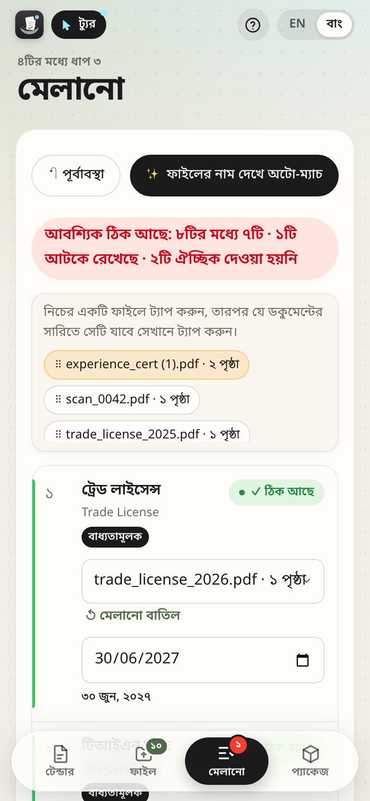
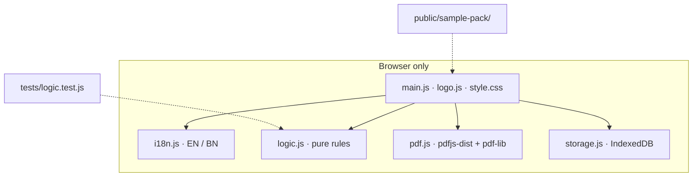

<p align="center">
  
</p>

# TenderNest

### Tender requirements in · one checked, ordered package PDF out — entirely in the browser, in English and বাংলা


> **Why is this hard?** Tender teams drown in PDFs: wrong order, expired licences, duplicate scans, missing mandatory docs, and a cover page that still has to be typed by hand. One bad page can sink a bid.

> **TenderNest answers one question:** _given this tender’s requirements and these PDFs, is the package complete, valid, and correctly ordered — and if so, download the submission PDF now?_

| Live demo | Reg. no. | Sample package | Tests | Languages |
| --------- | -------- | -------------- | ----- | --------- |
| **[tendernest.devabir.me](https://tendernest.devabir.me/)** | **261-15-001** | [`T-2026-0417_Package.pdf`](output/T-2026-0417_Package.pdf) | unit tests for status · match · duplicates | **EN + বাংলা** |

| | |
|---|---|
| **Name** | **MD ABIR HOSSAIN** |
| **Institution** | Daffodil International University |
| **Registration number** | 261-15-001 |
| **Live link** | https://tendernest.devabir.me/ |
| **Repository** | [github.com/0xdevabir/AI_DEV_FEST_261-15-001](https://github.com/0xdevabir/AI_DEV_FEST_261-15-001) |
| **Sample output** | [`output/T-2026-0417_Package.pdf`](output/T-2026-0417_Package.pdf) |
| **Screenshots** | [`screenshots/`](screenshots/) |
| **Full report** | [`docs/REPORT.md`](docs/REPORT.md) |

---

## 🎯 The problem and how we answer it

| The problem | What TenderNest does | Where to see it |
| ----------- | -------------------- | --------------- |
| Requirements arrive as JSON; humans still assemble PDFs by hand | Loads & validates `requirements.json`, sorts by `order`, shows tender meta | Step 1 |
| Wrong file type or corrupt PDF sneaks in | Rejects by extension **and** `%PDF-` header; clear bilingual errors | Upload step · Known problems |
| 1:1 matching is easy to break | Dropdown + **drag-and-drop** chips; moving a used file rematches; undo | Matching · Feature tour |
| Expiry dates are forgotten or applied silently | Date field only when `has_expiry`; PDF-detected date is a **suggestion**, never auto-applied | Expiry row |
| Generate proceeds with holes | Live statuses block generate until every mandatory row is OK | Feature tour · Safety |
| Package needs cover, order, footers | Builds cover + optional Bangla index + shrunk pages + footers with pdf-lib | Feature tour · Package |
| Bangla users get English-only tools | Full UI translation, Bangla digits, `title_bn` / `title_en` | Feature tour · বাংলা |

---

## 🔁 How it works

### One session, start to finish



### What happens when you press Generate



---

## ✅ Sample pack walkthrough

Bundled unchanged in [`public/sample-pack/`](public/sample-pack/).

1. Click **Load sample pack** — ten PDFs load; `company_logo.png` is rejected; the two `experience_cert` files flag as **Duplicate**.
2. Click **Auto-match by file names** — seven documents match; the valid 2026 trade licence wins over the expired 2025 one.
3. Click **Use it** on detected expiry dates (Trade License `2027-06-30`, Bank Solvency `2026-12-31`).
4. Match `scan_0042.pdf` (image-only scan) to **Signed Declaration** — dropdown or drag from the tray.
5. Click **Generate package** → download `T-2026-0417_Package.pdf`.

---

## 🖥️ Feature tour

Step-by-step frames from the **mobile** UI (iPhone-sized viewport · bottom tab bar · one step per screen). Click any image for the full PNG.

<table>
<tr>
<td width="50%" valign="top">
<a href="screenshots/00_home_empty.png"></a><br/>
<b>1 · Tender</b> — requirements shell before load.
</td>
<td width="50%" valign="top">
<a href="screenshots/01_sample_loaded_all_missing.png"></a><br/>
<b>2 · Sample pack</b> — tender meta + file count in the rail.
</td>
</tr>
<tr>
<td width="50%" valign="top">
<a href="screenshots/01b_files_uploaded.png"></a><br/>
<b>3 · Files</b> — thumbnails, duplicates, preview.
</td>
<td width="50%" valign="top">
<a href="screenshots/02_after_auto_match.png"></a><br/>
<b>4 · Match</b> — auto-match + file tray.
</td>
</tr>
<tr>
<td width="50%" valign="top">
<a href="screenshots/07_all_ok_drag_match_summary.png"></a><br/>
<b>5 · Status</b> — mandatory rows clear.
</td>
<td width="50%" valign="top">
<a href="screenshots/04_all_ok_ready_en.png"></a><br/>
<b>6 · Package</b> — generate unlocked.
</td>
</tr>
<tr>
<td width="50%" valign="top">
<a href="screenshots/05_generated_en.png"></a><br/>
<b>7 · Download</b> — preview + `<tender_id>_Package.pdf`.
</td>
<td width="50%" valign="top">
<a href="screenshots/06_bangla_ui.png"></a><br/>
<b>8 · বাংলা</b> — full UI in Bangla.
</td>
</tr>
</table>

### Also built in

| Surface | What it does |
| ------- | ------------ |
| **Animated intro** | ShopZen / R Slash–style splash — nest mark assembles, wordmark rises, zoom reveal; respects `prefers-reduced-motion` |
| **Brand system** | SVG logo with weave pattern — favicon, header lockup, footer, intro |
| **Live statuses** | Missing · Expiry needed · Expired · Not provided · OK — colour, icon, reason |
| **Index page** | Optional page after cover with Bangla titles (canvas → PNG at 300 dpi) |
| **Seal / signature** | PNG on chosen pages (`all`, `1, 3-5`, …), position + size |
| **Checklist CSV** | Excel-friendly export of match / status / expiry |
| **Autosave** | IndexedDB in this browser + save/open project `.json` |
| **Undo** | Ctrl/⌘+Z undoes the last change (including a whole auto-match) |
| **Optional AI** | User-pasted Anthropic key suggests matches; core app works with AI off |
| **Privacy** | Files never leave the machine — no upload, no backend, no serverless |

---

## 🏗️ Architecture



```
tendernest/
├── public/
│   ├── logo.svg · favicon.svg
│   └── sample-pack/          # official pack (unchanged) + manifest.json
├── screenshots/              # feature tour
├── output/                   # sample T-2026-0417_Package.pdf
├── docs/
│   ├── REPORT.md             # full system report
│   └── assets/logo.svg
├── src/
│   ├── main.js               # UI, events, generate flow
│   ├── logic.js              # status · match · duplicates · auto-match
│   ├── pdf.js                # inspect PDFs · build package
│   ├── i18n.js               # English + Bangla
│   ├── storage.js            # IndexedDB + project file
│   ├── logo.js               # inline SVG brand mark
│   └── style.css             # warm canvas · ink · sage theme
├── tests/logic.test.js
├── index.html                # intro splash + shell
└── vite.config.js
```

---

## ⚡ How to run

**Requirements:** Node.js 20.19+ (or 22+) and a modern Chromium browser (latest Google Chrome recommended).

```bash
npm install
npm run dev        # http://localhost:5173
npm test           # status / matching / duplicate unit tests
npm run build      # static dist/
npm run preview    # serve the build locally
```

The build is fully static. Host `dist/` on any HTTPS static host (Cloudflare Pages, Netlify, GitHub Pages, Vercel static). No server, no env secrets required for core features.

---

## Main features (done)

- **Requirements (4.1):** load & validate `requirements.json`; tender details; requirements sorted by `order`.
- **Upload (4.2):** multi-file + drag-and-drop; name, pages, size, thumbnail, preview; non-PDF rejected by name and content; remove / remove-all; limits **30 files · 50 MB** total.
- **Matching (4.3):** strict 1:1; dropdown or drag from tray / file list; rematch moves file; undo match; global Undo.
- **Expiry (4.4):** field only when `has_expiry` + matched; PDF date offered as one-click suggestion.
- **Live statuses (4.5):** Missing, Expiry date needed, Expired, Not provided, OK; deadline day = OK; ISO date compare (no TZ bugs); summary of mandatory OK / blockers / optional gaps.
- **Generate (4.6):** blocked while problems remain; cover + ordered docs + page footers (`tender_id | Page x of y`).
- **Download (4.7):** `<tender_id>_Package.pdf` with in-app preview.
- **Privacy (4.8):** everything local — no upload, no backend.
- **Bangla / English (4.9):** one-click switch for UI, statuses, errors, help; Bangla digits; remembered preference.

## Bonus features

- Index page with correctly shaped Bangla titles.
- Seal / signature PNG on chosen pages.
- Checklist CSV export.
- Autosave (IndexedDB) + save / open project file.
- Auto-match by file name + PDF text (synonyms; prefers still-valid docs; never double-uses a duplicate).
- Optional Claude-assisted matching (user-supplied key).
- Branded intro animation + SVG logo system.

## Known problems

- Password-protected PDFs are refused (remove the password first).
- Image-only scans have no text → auto-match cannot place them; match by hand.
- Pages scale to ~97% so footers never cover content (deliberate trade-off).
- Index page is a 300-dpi image → text is not selectable/searchable.
- Drag-and-drop matching needs a mouse; on touch, use the row dropdown.
- Optional AI needs a user-pasted Anthropic key and network; the rest of the app works offline from that API.

## AI tools used

- **Claude / Cursor agents** — planning from the rulebook & sample pack, implementation, tests, UI polish, intro branding, README/report.
- **Playwright / browser tooling** — sample package generation and screenshots where used.

## Most useful prompt

> Read the contest materials carefully, make a solid plan, then build and ship a working solution that fully follows the rules and uses the required sample pack. Stay fully rule-compliant. Prefer choices that maximize score under the official scoring criteria. If something is ambiguous, state your assumption and choose the safest compliant option. Do not ignore or replace the sample pack.

## Assumptions

- “Date made” on the cover is the generation date (`YYYY-MM-DD`).
- The 50 MB limit applies to all uploaded files together.
- Deadline-day expiry counts as still valid (OK).

---

## License

[MIT](LICENSE) · © 2026 MD ABIR HOSSAIN · Daffodil International University

Built for **AI DevFest 2026** (Vibe Coding) · [Live demo](https://tendernest.devabir.me/) · [Full system report](docs/REPORT.md)
