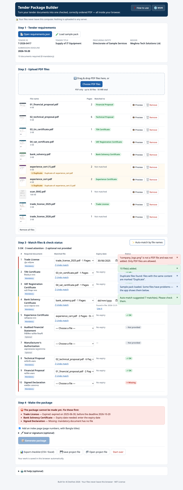

# Tender Document Package Builder

A frontend-only web app for AI DevFest 2026 (Vibe Coding). It turns a tender's `requirements.json` and a pile of PDFs into **one checked, correctly ordered submission PDF**: `<tender_id>_Package.pdf`.
Everything runs in the browser. No file is uploaded anywhere, and there is no backend or serverless function.

| | |
|---|---|
| **Name** | _<your full name>_ |
| **Registration number** | 261-15-001 |
| **Live link** | _<https://0xdevabir.github.io/AI_DEV_FEST_261-15-001/> — fill in after deploying>_ |
| **Sample output** | [`output/T-2026-0417_Package.pdf`](output/T-2026-0417_Package.pdf), made from the official sample pack |
| **Screenshots** | [`screenshots/`](screenshots/) |



## How to run

You need Node.js 20.19+ (or 22+) and the latest Google Chrome.

```bash
npm install
npm run dev        # open the URL it prints (http://localhost:5173)
npm test           # unit tests for the status / matching / duplicate rules
npm run build      # static build in dist/ (deploy anywhere over HTTPS)
npm run preview    # serve the build locally
```

To try it quickly, click **Load sample pack**. It loads the official sample pack (bundled unchanged in `public/sample-pack/`), including the PNG logo, so you can see it being rejected. You can also open `requirements.json` and drag in PDFs yourself.

### Steps for the sample pack
1. Click **Load sample pack**. Ten PDFs are added, `company_logo.png` is rejected, and the two `experience_cert` files are marked **Duplicate**.
2. Click **Auto-match by file names**. Seven documents are matched. The valid 2026 trade licence is picked over the expired 2025 one.
3. Click **Use it** on the detected expiry dates (Trade License 2027-06-30, Bank Solvency 2026-12-31).
4. Match `scan_0042.pdf` (an image-only scan with a meaningless name) to **Signed Declaration**.
5. Click **Generate package**, then download `T-2026-0417_Package.pdf` (17 pages).

## Main features (problem statement §4)
- **Requirements (4.1):** loads and validates `requirements.json` with clear errors for bad JSON, a missing tender or a bad deadline. Shows the tender details and requirements sorted by `order`.
- **Upload (4.2):** multi-file picker and drag-and-drop. Shows each file's name, page count, size and a thumbnail, with a preview. Non-PDFs are rejected by name *and* by content (`%PDF-` header) with a clear message. Files can be removed. Limits are 30 files and 50 MB in total.
- **Matching (4.3):** strictly 1:1. Choosing a file already used elsewhere moves it. **Undo match** clears a match.
- **Expiry (4.4):** a date field appears only when `has_expiry` is true and a file is matched. The date found in the PDF text is offered as a one-click suggestion, never applied silently.
- **Live statuses (4.5):** Missing, Expiry date needed, Expired, Not provided and OK, with colour, icon and reason. An expiry date on the deadline day counts as OK. Dates are compared as ISO strings, so there are no timezone bugs.
- **Duplicates (4.6):** found by SHA-256 of the content, not the file name. A duplicate copy cannot be matched to a different document; the option is disabled.
- **Blocking (4.7):** **Generate** stays disabled while anything blocks. The app lists every blocking document and why. Optional documents never block.
- **Package (4.8):**
  - Page 1 is an English cover with the tender ID, title, procuring entity, bidder, deadline, date made, and the included documents in order with their page counts and start pages.
  - All pages of every matched document follow, in `order`. Optional documents without a file are skipped.
  - Every page has the footer `<tender_id> | Page X of Y`. Each source page is scaled slightly into the area above a reserved footer band, so the footer **never covers content**. Rotated pages are handled.
- **Bangla / English (4.9):** the whole UI switches with one click, including statuses, errors and help. Requirement titles use `title_bn` / `title_en`, numbers use Bangla digits, and the choice is remembered.

## Bonus features
- **Index page** after the cover, with page ranges and **Bangla titles**. It is rendered with the browser's own text shaping, so the Bangla conjuncts are correct.
- **Seal / signature PNG** on chosen pages (`all`, `1, 3-5`, …), with a choice of position and size.
- **Checklist export** as CSV that opens in Excel (UTF-8 BOM, so Bangla displays correctly).
- **Save / reopen:** autosaves to IndexedDB in this browser, and can save or open a project file (`.json`).
- **Auto-match** by file name and the PDF's own text, with synonyms (e.g. TIN/tax, MAF). It prefers documents still valid on the deadline and never uses a duplicate twice.
- **Damaged and password-protected PDFs** are refused with a clear message instead of crashing.
- **Expiry-date detection** from the PDF text (e.g. "Valid until 30 June 2025").
- **Optional AI help:** asks Claude to review the matches and suggest which unused file could fill a gap. It uses **your own** Anthropic API key, typed into the app and kept only in your browser's localStorage, and sends only file names, statuses and the first lines of text. Everything else works without AI.

## Known problems
- Password-protected PDFs are refused. The user must remove the password first; we don't ask for it.
- Image-only scans (e.g. `scan_0042.pdf`) have no text, so auto-match cannot place them and they must be matched by hand.
- The cover page uses the standard PDF font, so it is English only (as required). Bangla appears on the index page instead.
- The PDF preview inside the page uses Chrome's built-in viewer. If it's turned off, use **Download** instead.
- Pages are scaled to about 97% so the footer has its own space. This is a deliberate trade-off so the footer never covers content.
- The AI help needs an internet connection and a valid key, and it may be wrong. It only gives advice and never changes matches by itself.

## AI tools used
- **Claude Code (Claude Opus 5.5)** read the rulebook, problem statement and sample pack, then planned, wrote and tested the app. It also drove Chrome with Playwright to create the sample output and the screenshots.

**Most useful prompt:**
> Read the contest materials carefully, make a solid plan, then build and ship a working solution that fully follows the rules and uses the required sample pack … Stay fully rule-compliant. Prefer choices that maximize score under the official scoring criteria. If something is ambiguous, state your assumption and choose the safest compliant option. Do not ignore or replace the sample pack.

## Assumptions
- "Date made" on the cover is the date the package is generated (`YYYY-MM-DD`).
- Expired means the expiry date is **before** the submission deadline. The same day is valid.
- The 50 MB limit applies to all uploaded files together.

## Project layout
```
src/logic.js    status, matching, duplicate and auto-match rules (pure, unit tested)
src/pdf.js      PDF reading (pdf.js) and package building (pdf-lib)
src/i18n.js     English / Bangla text
src/storage.js  IndexedDB autosave and project file
src/main.js     user interface
public/sample-pack/  official sample pack (unchanged) + manifest.json
```

## License
[MIT](LICENSE)
