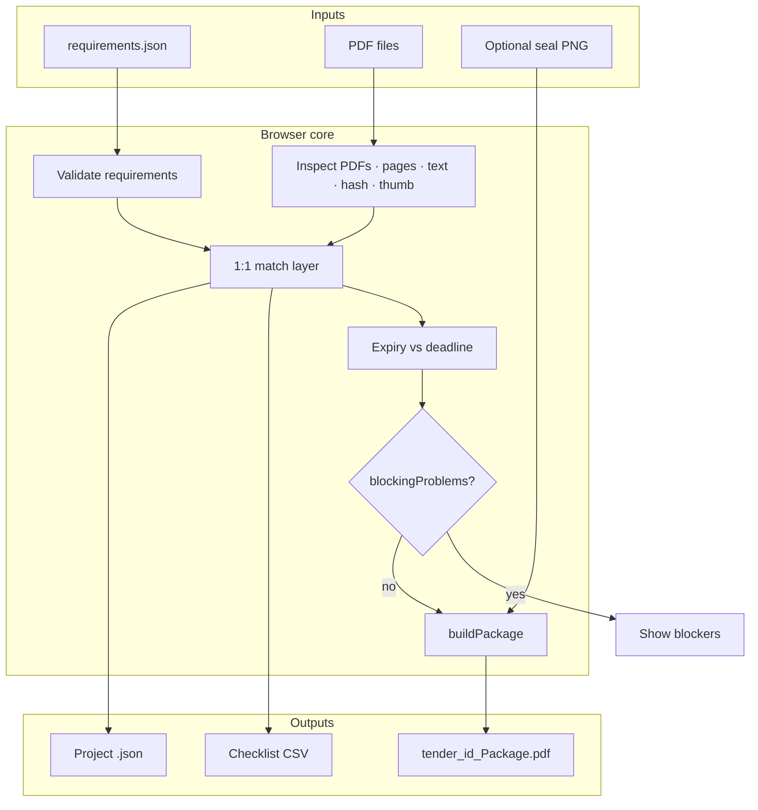

# TenderNest — System Report

**AI DevFest 2026 · Vibe Coding Contest**  
**Author:** MD ABIR HOSSAIN · Daffodil International University · Registration **261-15-001**  
**Live product:** [https://tendernest.devabir.me/](https://tendernest.devabir.me/)  
**Repository:** [github.com/0xdevabir/AI_DEV_FEST_261-15-001](https://github.com/0xdevabir/AI_DEV_FEST_261-15-001)  
**Sample artefact:** [`output/T-2026-0417_Package.pdf`](../output/T-2026-0417_Package.pdf)  
**License:** MIT

<p align="center">
  
</p>

> **Tagline:** Tender requirements in. One checked, ordered package PDF out — all inside the browser, in English and বাংলা.

This report is the long-form technical and product narrative for TenderNest: problem framing, design language, information architecture, algorithms, PDF pipeline, privacy model, i18n, testing, deployment, known limits, and judging walkthrough. It complements the concise [`README.md`](../README.md).

---

## 1. Executive summary

TenderNest is a **frontend-only** web application that helps bidding staff turn a tender’s machine-readable requirements (`requirements.json`) and a folder of PDF evidence into a single submission package:

`<tender_id>_Package.pdf`

The package includes:

1. A professional **cover page** (tender meta, bidder, date, included documents).
2. An optional **index / সূচিপত্র** with English and Bangla titles and page ranges.
3. Every matched PDF **in requirement order**, scaled slightly so a footer band never covers content.
4. A **footer** on every page: `tender_id | Page x of y`.
5. An optional **seal / signature PNG** stamped on chosen pages.

Nothing is uploaded to a server. There is **no backend, no serverless function, and no participant-controlled database**. Persistence uses **IndexedDB** (autosave) and optional project `.json` files. An optional Claude call (user-pasted API key) can suggest matches; the core workflow works with AI disabled.

| Metric | Value |
| ------ | ----- |
| Contest | AI DevFest 2026 · Vibe Coding |
| Hosting | Static HTTPS — [tendernest.devabir.me](https://tendernest.devabir.me/) |
| Stack | Vite · vanilla JS modules · pdf.js · pdf-lib · IndexedDB |
| Languages | English + বাংলা (full UI) |
| Sample package pages | 17 (official sample pack) |
| File limits | 30 PDFs · 50 MB total |
| Backend calls for core path | **0** |

---

## 2. Problem statement — why TenderNest exists

Public and private tenders in Bangladesh (and elsewhere) still close with **paper-shaped PDF bundles**. Staff collect licences, proposals, bank letters, declarations, and scans. Failures are mundane and expensive:

| Failure mode | Consequence |
| ------------ | ----------- |
| Document missing | Bid rejected at preliminary check |
| Wrong order vs checklist | Package returned / delayed |
| Expired trade licence or solvency letter | Mandatory fail |
| Duplicate scans of the same certificate | Confusion, wasted pages |
| Non-PDF “logo” or image slipped into the set | Invalid evidence |
| Cover / page numbers typed late at night | Human error under deadline pressure |

TenderNest treats the tender checklist as **data**, not a Word note, and treats the browser as a **secure local workshop**: validate → upload → match → check → generate → download.

---

## 3. Product goals & non-goals

### Goals

- **Correctness first:** generate only when mandatory requirements are green.
- **Explainability:** every blocked state has a human reason (EN/BN).
- **Local privacy:** PDFs never leave the device for the core path.
- **Bilingual by default:** not a bolted-on translation layer.
- **Judge-ready sample path:** official sample pack loads in one click.
- **Brand presence:** TenderNest is a named product with a mark, intro, and theme — not a generic form dump.

### Non-goals

- Multi-user collaboration servers.
- Cloud OCR of image-only scans (hand-match remains).
- Decrypting password-protected PDFs.
- Replacing e-GP portals — TenderNest prepares the **package artefact**.

---

## 4. Design language (theme)

TenderNest’s visual system is intentional and consistent with a calm “workshop for serious paper”:

| Token | Value | Role |
| ----- | ----- | ---- |
| Canvas | `#F3EFE6` | Warm wheat background |
| Card | `#FFFDF9` | Surfaces for work |
| Ink | `#1B1B1B` | Primary chrome / buttons |
| Sage accent | `#A8BCA1` / `#4F6A47` | Success, focus rings, nest |
| Highlight | `#96EEFB` | Info / accent dot on logo |
| Type | Geist + Noto Sans Bengali | UI EN / BN |
| Motion | Spring easings | Press feedback, intro |

### Brand mark

The SVG logo (`public/logo.svg`, `src/logo.js`) encodes the product metaphor:

- **Dark tile** — professional tool, not a toy.
- **Woven nest bowl** (sage + hatch pattern) — documents are *kept*, not scattered.
- **Two paper sheets** with a check — package completeness.
- **Cyan status dot** — ready / live check.

The mark appears in the favicon, sticky header lockup, footer, and opening intro.

### Opening intro

Inspired by production intros on [ShopZen](https://shopzen.bd/), [R SLASH](https://rslash.bd/), and [WebNest](https://www.webnest.app/):

1. Dark full-screen stage.
2. Logo **pieces assemble** (tile → nest → papers → accent dot).
3. **TenderNest** wordmark rises from a clip.
4. Soft glow, then a **zoom-out reveal** into the warm app canvas.
5. Timing holds long enough to read (~2.2s assemble/hold, exit by ~3.3s).
6. `prefers-reduced-motion: reduce` skips the splash entirely.

---

## 5. Information architecture

The UI is a single-page progressive workflow:

```text
┌──────────────────────────────────────────────────────────┐
│  Sticky ink header · logo · TenderNest · Help · বাংলা   │
├──────────────────────────────────────────────────────────┤
│  Privacy strip                                            │
│  Notices (errors / ok / info)                             │
│  Step 1  Tender requirements                              │
│  Step 2  Upload PDF files                                 │
│  Step 3  Match files & check status                       │
│  Step 4  Make the package (+ seal, CSV, project, AI)      │
│  Footer brand + contest note                              │
└──────────────────────────────────────────────────────────┘
```

Optional surfaces: PDF preview modal, sticky unused-file tray for drag matching, confirm dialogs for destructive actions.

---

## 6. End-to-end workflow



### Sample pack path (judging)

1. **Load sample pack** → tender `T-2026-0417`, ten PDFs, PNG rejected, duplicate experience certs flagged.
2. **Auto-match** → seven matches; 2026 trade licence preferred over 2025.
3. **Accept suggested expiries** for licence & bank solvency.
4. **Hand-match** `scan_0042.pdf` → Signed Declaration.
5. **Generate** → download & preview package (17 pages in the reference build).

---

## 7. Domain rules (logic layer)

Pure functions live in `src/logic.js` and are unit-tested in `tests/logic.test.js`.

### 7.1 Requirements validation

- Object with `tender` and non-empty `requirements[]`.
- Deadline must match `YYYY-MM-DD`.
- Requirement IDs unique; sorted stably by `order`.
- Fields normalised: `mandatory`, `has_expiry`, bilingual titles.

### 7.2 Status model

For each requirement:

| Status | Meaning | Blocks generate? |
| ------ | ------- | ---------------- |
| `missing` | Mandatory, no file | Yes |
| `expiry_needed` | Matched, needs expiry date | Yes |
| `expired` | Expiry &lt; submission deadline | Yes |
| `not_provided` | Optional, no file | No |
| `ok` | Matched and (if needed) still valid | No |

**Deadline-day rule:** expiry equal to the submission deadline counts as **OK** (still valid that day). Comparisons use ISO date strings — no timezone drift.

### 7.3 Matching

- Strict **1:1** between files and requirements.
- Assigning a file already used elsewhere **moves** the match.
- Undo match clears one link; global Undo restores previous project snapshot.

### 7.4 Duplicates

Files with identical content hashes (or equivalent duplicate detection) are grouped. Auto-match **never uses a duplicate twice**. UI badges warn staff.

### 7.5 Auto-match

Scores candidates from:

- File name tokens vs requirement titles / synonyms (e.g. TIN ↔ tax, MAF).
- Extracted PDF text when available.
- Preference for documents still valid on the deadline when expiry cues exist.

Image-only scans without text cannot be auto-placed — intentional.

---

## 8. PDF pipeline

`src/pdf.js` uses **pdf.js** for reading and **pdf-lib** for writing.

### 8.1 Ingest

For each file:

1. Size / count limits.
2. Extension + magic-byte `%PDF-` check.
3. Load with pdf.js → page count, text extract (best-effort), thumbnail of page 1.
4. SHA-256 for duplicate detection and project integrity.
5. Encrypted PDFs → refuse with clear message.

### 8.2 Package build

```text
PDFDocument.create()
  ├─ Cover page (Helvetica; ANSI-safe meta)
  ├─ Optional index (canvas PNG with Noto Sans Bengali shaping → embed)
  ├─ For each matched doc in order:
  │    embedPages → placeShrunk (~97%) above footer band
  ├─ Optional seal PNG on selected page numbers / positions
  └─ drawFooter on every page
```

**Why shrink pages?** Footers must never obscure bidder content. ~97% scale + reserved footer height is a deliberate printing trade-off.

**Why raster index?** Bangla conjuncts need the browser’s text shaper. Canvas at 300 dpi preserves print quality; selectable text on the index is sacrificed.

---

## 9. Persistence & project files

| Mechanism | Purpose |
| --------- | ------- |
| IndexedDB autosave | Resume work after refresh in the same browser |
| Export project `.json` | Portable snapshot (reqs, matches, expiries, seal meta, file buffers) |
| Import project `.json` | Continue on another machine without re-uploading one-by-one |
| `localStorage` language | Remember EN / BN |

Format guard: `format: 'tender-package-builder'` on import.

---

## 10. Internationalisation

`src/i18n.js` holds **every** visible string in `en` and `bn`.

- `t(key, vars)` interpolation.
- `num()` maps digits to Bangla numerals in BN mode.
- `reqTitle(r)` picks `title_bn` / `title_en`.
- Help steps, errors, statuses, buttons, confirmations — all translated.
- Font stack switches to Noto Sans Bengali when `lang=bn`.

---

## 11. Optional AI assist

Behind a `<details>` panel in Step 4:

- User pastes an Anthropic API key (stored only in **session**, clearable).
- App can ask Claude for match suggestions given requirement titles and file names/text snippets.
- Failures surface as notices; **Generate never depends on AI**.
- Contestable rule: no hard-coded secrets in the repo or build.

---

## 12. Security & privacy model

| Threat / concern | Mitigation |
| ---------------- | ---------- |
| Accidental cloud upload | No upload endpoints; Blob URLs local |
| Key leakage | AI key session-only; never committed |
| XSS via file names | `esc()` on all interpolated user/file strings |
| Malicious PDF | Sandboxed in-browser parsers; no native bridge |
| Contest backend ban | Zero participant servers / serverless / Firebase |

---

## 13. Accessibility & motion

- Sticky header actions remain keyboard-reachable.
- Focus rings use sage soft glow.
- Confirmations for destructive resets.
- Intro and entrance animations honour **`prefers-reduced-motion`**.
- Status colours paired with icons/text (not colour alone).

---

## 14. Testing

| Layer | Coverage |
| ----- | -------- |
| `npm test` | Status transitions, matching moves, duplicates, auto-match preferences, deadline-day expiry |
| Manual sample pack | Full generate path → reference PDF in `output/` |
| Screenshot suite | EN / BN / blocked / ready / generated / drag / confirm |

---

## 15. Deployment

- `vite build` → static `dist/`.
- Production URL: **https://tendernest.devabir.me/**
- Core features need only HTTPS static hosting + modern Chrome.
- No environment variables required for mandatory features.

---

## 16. Repository map

| Path | Responsibility |
| ---- | -------------- |
| `index.html` | Meta, favicon, intro splash shell |
| `src/main.js` | UI render, events, generate orchestration |
| `src/logic.js` | Pure domain rules |
| `src/pdf.js` | Inspect + package |
| `src/i18n.js` | EN/BN dictionary |
| `src/storage.js` | IndexedDB + project I/O |
| `src/logo.js` | Brand SVG factory |
| `src/style.css` | Theme, layout, intro keyframes |
| `public/sample-pack/` | Official contest sample (unchanged) |
| `screenshots/` | Visual evidence for judges |
| `docs/REPORT.md` | This document |

---

## 17. Visual evidence index

Current UI captures (sidebar / warm canvas / sage theme):

| File | Shows |
| ---- | ----- |
| `00_home_empty.png` | Brand home shell before a tender is loaded |
| `01_sample_loaded_all_missing.png` | Sample pack loaded |
| `01b_files_uploaded.png` | Upload list with duplicates |
| `02_after_auto_match.png` | Auto-match suggestions |
| `03_expired_blocks_generate.png` | Generate blocked by expiry / missing |
| `04_all_ok_ready_en.png` | All mandatory OK — ready to generate |
| `05_generated_en.png` | Package downloaded / preview |
| `06_bangla_ui.png` | Bangla match UI |
| `07_all_ok_drag_match_summary.png` | Match clear with tray |
| `08_bangla_all_ok.png` | Bangla package ready |
| `09_confirm_dialog.png` | Help panel |

---

## 18. Known limitations (honest)

1. Password-protected PDFs must be unlocked outside the app.
2. Image-only scans need manual matching.
3. Index page text is not selectable (raster for Bangla shaping).
4. Page content is slightly scaled for footer clearance.
5. Drag-match is mouse-oriented; touch uses dropdowns.
6. Optional AI needs network + user key; offline core remains intact.

---

## 19. Assumptions recorded for judges

- Cover “date made” = generation date (`YYYY-MM-DD`).
- 50 MB cap = sum of all uploaded files.
- Expiry on the deadline day is **OK**.
- Sample pack bytes in `public/sample-pack/` are the official set, not replaced.

---

## 20. AI disclosure

| Use | Tool | Notes |
| --- | ---- | ----- |
| Planning & implementation | Claude / Cursor agents | From rulebook + sample pack |
| UI / brand / intro | Same | Theme aligned to warm canvas + sage |
| Screenshots / sample PDF | Browser automation where used | Against local build |
| Optional in-product assist | Anthropic API | User-supplied key only |

**Most useful prompt (contest):**

> Read the contest materials carefully, make a solid plan, then build and ship a working solution that fully follows the rules and uses the required sample pack. Stay fully rule-compliant. Prefer choices that maximize score under the official scoring criteria. If something is ambiguous, state your assumption and choose the safest compliant option. Do not ignore or replace the sample pack.

---

## 21. Author

**MD ABIR HOSSAIN**  
Student · Daffodil International University  
Registration **261-15-001**  

**Live:** [tendernest.devabir.me](https://tendernest.devabir.me/)  
**GitHub:** [0xdevabir](https://github.com/0xdevabir)

---

## 22. Closing

TenderNest is a complete, deployable answer to the tender-package problem under AI DevFest’s frontend-only rules: bilingual, private-by-architecture, status-driven, sample-pack verified, and branded as a real product rather than a throwaway form.

For a shorter entry point, see the repository [`README.md`](../README.md). For a hands-on trial, open the live site and click **Load sample pack**.
